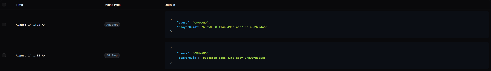
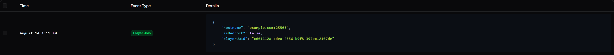
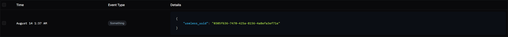

import {Aside, TabItem, Tabs} from "@astrojs/starlight/components";

<br/>

<Aside type="tip" title="Before You Start">
    - **Set up your SDK instance**: If you haven't already set up your Hoglin instance, follow the [Creating Your Instance](/developer-sdk/creating-your-instance) guide.
    - **Understand the Event Queue**: Familiarize yourself with the event queue and flushing strategies in the [Introduction To Tracking](/developer-sdk/tracking-analytics/introduction-to-tracking/) guide.
</Aside>

<br/>

## Outline
By implementing the `Analytic` or `NamedAnalytic` interfaces, you can quickly model events as real types. Tracking with
these brings type safety whilst keeping implementation simple and flexible.
With both interfaces, the key idea is to define a class that represents your event data as typed fields. NamedAnalytic
goes one step further by providing a way to specify the event type name directly in the class, eliminating the need to
specify it in the tracking call. Usage: `Hoglin#track(String eventName, Analytic analytic)` or `Hoglin#track(NamedAnalytic analytic)`.

| Interface       | Use When                         | Key Idea                                                    |
|-----------------|----------------------------------|-------------------------------------------------------------|
| `Analytic`      | Unknown event type until runtime | Use this if you have multiple events with the same data     |
| `NamedAnalytic` | Known event type                 | Adds `getEventType()` so the instance supplies its own name |

<br/>

## Using Analytic
Choose `Analytic` when your event name is decided at runtime or when multiple events share the same data structure.

<Tabs>
  <TabItem label="Java" icon="seti:java">

```java
class PlayerAfkAnalytic implements Analytic {
    final UUID playerUuid;
    final String cause;

    PlayerAfkAnalytic(final UUID playerUuid, final String cause) {
        this.playerUuid = playerUuid;
        this.cause = cause;
    }
}
```
```java
Hoglin hoglin = /** Your Hoglin instance */
boolean isAfk = /** Example runtime boolean */

if (isAfk) {
    hoglin.track("afk_start", new PlayerAfkAnalytic(UUID.randomUUID(), "COMMAND"))
} else {
    hoglin.track("afk_stop", new PlayerAfkAnalytic(UUID.randomUUID(), "COMMAND"))
}
```
  </TabItem>
  <TabItem label="Kotlin" icon="seti:kotlin">

```kotlin
data class PlayerAfkAnalytic(
      val playerUuid: UUID,
      val cause: String
) : Analytic
```
```kotlin
val hoglin: Hoglin = /** Your Hoglin instance */
val isAfk: Boolean = /** Example runtime boolean */

if (isAfk) {
      hoglin.track("afk_start", PlayerAfkAnalytic(UUID.randomUUID(), "COMMAND"))
} else {
      hoglin.track("afk_stop", PlayerAfkAnalytic(UUID.randomUUID(), "COMMAND"))
}
```
  </TabItem>
</Tabs>



<br/>

## Using NamedAnalytic (recommended when possible)
Choose `NamedAnalytic` when your event name at known at compile time.

<Tabs>
  <TabItem label="Java" icon="seti:java">

```java
public class PlayerJoinAnalytic implements NamedAnalytic {
    final UUID playerUuid;
    final String hostname;
    final boolean isBedrock;

    public PlayerJoinAnalytic(final UUID playerUuid, final String hostname, final boolean isBedrock) {
        this.playerUuid = playerUuid;
        this.hostname = hostName;
        this.isBedrock = isBedrock;
    }

    @Override
    public @NotNull String getEventType() { return "player_join"; }
}
```
```java
Hoglin hoglin = /** Your Hoglin instance */;
hoglin.track(new PlayerJoinAnalytic(UUID.randomUUID(), "example.com:25565", false));
```
  </TabItem>
  <TabItem label="Kotlin" icon="seti:kotlin">

```kotlin
data class PlayerJoinAnalytic(
    val playerUuid: UUID,
    val hostname: String,
    val isBedrock Boolean
) : NamedAnalytic {
    override fun getEventType(): String = "player_join"
}
```
```kotlin
val hoglin: Hoglin = /* Your Hoglin instance */
hoglin.track(PlayerJoinAnalytic(UUID.randomUUID(), "example.com:25565", false))
```
  </TabItem>
</Tabs>



<br/>

You can do a lot more with your data, visualizing and aggregating it in various ways, follow this guide to learn more
about [Exploring Your Data](/guides/exploring-your-data) in the Hoglin dashboard.

<br/>

## Renaming your typed parameters
You can can use GSON's `@SerializedName` annotation to apply a custom name to your parameters when they get serialized.
This proves useful for using different naming schemes in your codebase and in Hoglin.
<Tabs>
    <TabItem label="Java" icon="seti:java">
```java
public class SomeAnalytic implements NamedAnalytic {
    @SerializedName("useless_uuid") final UUID someParameterName;

    public SomeAnalytic(final UUID someParameterName) {
        this.someParameterName = someParameterName;
    }

    @Override
    public @NotNull String getEventType() { return "something"; }
}
```
```java
Hoglin hoglin = /** Your Hoglin instance */;
hoglin.track(new SomeAnalytic(UUID.randomUUID()));
```
    </TabItem>
    <TabItem label="Kotlin" icon="seti:kotlin">

```kotlin
data class SomeAnalytic(
    @SerializedName("useless_uuid") val someParameterName: UUID,
) : NamedAnalytic {
    override fun getEventType(): String = "something"
}
```
```kotlin
val hoglin: Hoglin = /* Your Hoglin instance */
hoglin.track(SomeAnalytic(UUID.randomUUID()))
```
    </TabItem>
</Tabs>


