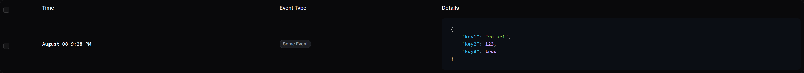

import {Aside, TabItem, Tabs} from "@astrojs/starlight/components";

<br/>

<Aside type="tip" title="Before You Start">
    - **Set up your SDK instance**: If you haven't already set up your Hoglin instance, follow the [Creating Your Instance](/developer-sdk/creating-your-instance) guide.
    - **Understand the event queue**: Familiarize yourself with the event queue and flushing strategies in the [Introduction To Tracking](/developer-sdk/tracking-analytics/introduction-to-tracking/) guide.
</Aside>

<Aside type="caution" title="Consider using Analytic and NamedAnalytic">
    Tracking with maps is an older method of tracking events in Hoglin. It remains supported, but we recommend using
    the newer Analytic and NamedAnalytic interfaces as they allows for typesafety and keeping your event paremeters
    consistent. You can learn more about these interfaces in the [Analytic and NamedAnalytic](/developer-sdk/tracking-analytics/analytic-and-namedanalytic/) guide.
</Aside>

<br/>

Tracking with maps is the easiest way to start tracking custom events with Hoglin. As the name suggests, we construct
our events parameters using a map of key-value pairs, where the keys are strings and the values can be of any type as
long as they can be serialized - see the [Custom Types and Serializers](/developer-sdk/tracking-analytics/custom-types-and-serializers)
guide if you'd like to add or modify serialization for specific types. The name of the event itself is passed in
separately as a string. Usage: `Hoglin#track(String eventName, Map<String, Object> parameters)`.

## Full code example:

<br/>

<Tabs>
    <TabItem label="Java" icon="seti:java">
        ```java
        Hoglin hoglin = /** Your Hoglin instance */;
        hoglin.track("some_event", Map.of(
            "key1", "value1",
            "key2", 123,
            "key3", true
        ));
        ```
    </TabItem>
    <TabItem label="Kotlin" icon="seti:kotlin">
        ```kotlin
        val hoglin = /** Your Hoglin instance */
        hoglin.track("some_event", mapOf(
            "key1" to "value1",
            "key2" to 123,
            "key3" to true
        ))
        ```
    </TabItem>
</Tabs>

After executing this, the event will be tracked in the event queue and sent off to Hoglin when the next auto-flush
(or manual flush) is carried out.

<br/>

## Looking back at the dashboard
After an event has been pushed to Hoglin, you should be able to see it update in real-time on the Hoglin dashboard.
For the example above, it would look something like this:

[//]: # (TODO: Replace with non placeholder image)


You can do a lot more with your data, visualizing and aggregating it in various ways, follow this guide to learn more
about [Exploring Your Data](/guides/exploring-your-data) in the Hoglin dashboard.
