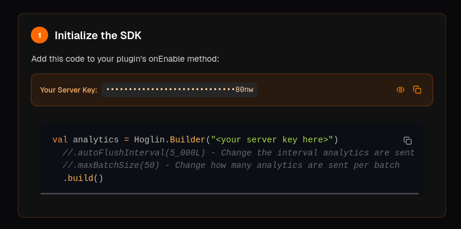

import { Steps } from '@astrojs/starlight/components';
import { Tabs, TabItem } from '@astrojs/starlight/components'
import { Aside } from '@astrojs/starlight/components';

Ready to start tracking analytics? Here’s how to create your first server in Hoglin.

<br/>
<br/>

<Steps>

1. ### Login to Hoglin

   Log in to your [Hoglin Dashboard](https://hoglin.gg/dashboard).

   - If you don’t have an account yet, [create one here](https://hoglin.gg/login).
   - Once logged in, you’ll land on the server creation page.

   <br/>

2. ### Fill out server details

    You'll be prompted to enter:

    **Server name**: This is how your server will appear in your dashboard

    **Dashboard URL**: This is the name you'll access your server by, it's unique per user, so choose anything!

    _(Only lowercase letters, numbers, and hyphens are allowed.)_

3. ### Get your API key

    Once you've created a server, you'll land onto our onboarding page. This page includes your server key, and it's required to use our software.

    **Copy your server key** using the copy button

    <Aside type="tip">

      You can find and reset your server key any time on your servers settings.

    </Aside>

    


4. ### Add the SDK to Your Plugin

     Now you’re ready to integrate Hoglin into your Minecraft server!

      [Follow the Getting Started guide →](/getting-started)

      Enter your Server Key into the SDK initialization code:

      <sub>(ideally you would use a custom configuration option for this)</sub>


      <Tabs>
      <TabItem label="Kotlin">
          ```kotlin
          val analytics = Hoglin.Builder("<your server key>")
              .autoFlushInterval(5_000L)
              .maxBatchSize(50)
              .build()
          ```
      </TabItem>
      <TabItem label="Java">
          ```java
          Hoglin analytics = new Hoglin.Builder("<your server key>")
              .autoFlushInterval(5_000L)
              .maxBatchSize(50)
              .build();
          ```
      </TabItem>
      </Tabs>

      Implement the [`Hoglin#track`](/reference/sdk#trackeventtype-string-properties-mapstring-any) method anywhere you want to track events.

      Restart your server and watch events appear in your dashboard!

5. ### Invite Team Members (Optional)

    Users on the **Network** plan and above can invite users to their Hoglin dashboard.

    1. Go to your servers **Settings** tab
    2. Click **Add User** within the **Users** section
    3. Enter the users username or Hoglin email

    [Learn more about User Management →](guides/invite-user)

</Steps>

## FAQ

**Where do I find my server key later?**

Go to your server’s settings in the dashboard. Your key is always visible with a copy button.

**Can I change my dashboard URL?**

Yes! Edit your server settings and update the “Dashboard URL” field.

**How do I delete or wipe a server?**

In your server’s settings, scroll down to find options for “Wipe Analytics” or “Delete Server.”

Keep in mind, these actions are permanent.
